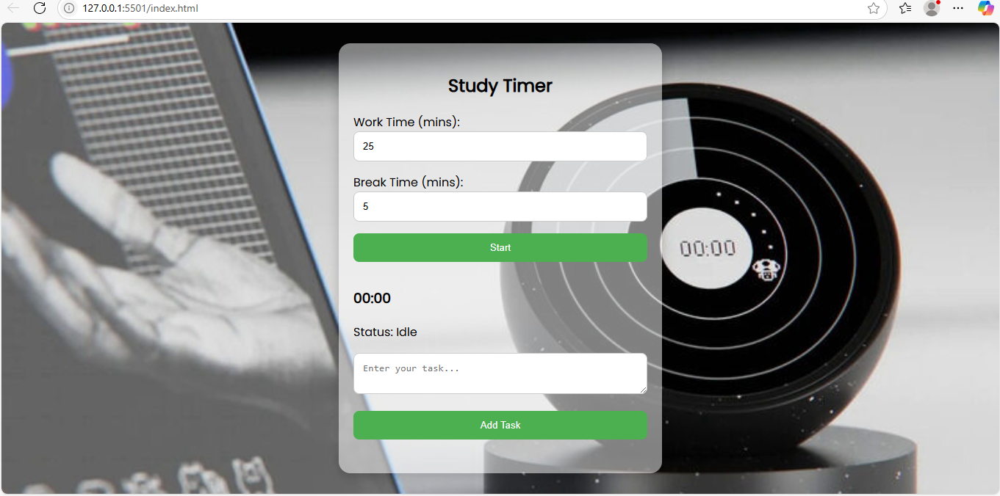

 #  Virtual Study Timer:
   
 Virtual Study Timer is a simple and clean productivity tool I built to help students and remote workers stay focused and organized while studying or working from home.

  ##      Tech Stack:

1. HTML – For the structure of the page

2. CSS – To make it look nice and responsive
 
3. JavaScript – To handle the timer and task tracking

 4. Git & GitHub – For version control and sharing the code

  ##          Functionality:
* Set your own work and break durations

* Get a live countdown timer with status updates (like "Working..." or "Break Time!")

* Track your tasks as you go

* See an RTO (Return to Office) notification when your session ends

* Works great on phones, tablets, and desktops

## 📷 Preview

## Live Demo
[Live Demo](https://virtual-study-timer-git-master-shrishtikumariis-projects.vercel.app/)

